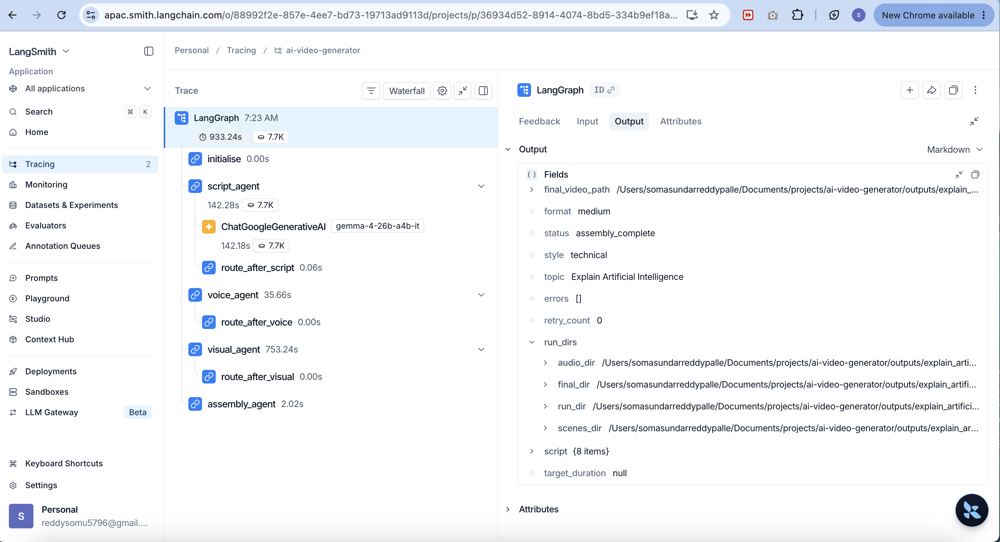

# 🎬 AI Video Generator

A production-style **multi-agent AI video generation pipeline** built with LangGraph, Manim, ElevenLabs and FFmpeg. Give it a topic — it writes the script, generates voiceover, renders kinetic typography animations, and assembles a final MP4 ready for YouTube. No camera, no editor, no studio.

---

## 🎬 Demo

```bash
python3 main.py --topic "Explain what is Kafka and why companies use it"
```

Opens final MP4 automatically:

```bash
open outputs/<run_folder>/final/<title>_final.mp4
```

---

## 🧠 What This Project Demonstrates

Every architectural decision was made deliberately and can be explained technically:

| Concept | Implementation | Why |
|---|---|---|
| Multi-agent orchestration | LangGraph StateGraph with 5 nodes | Each agent independently testable, failure-isolated with conditional routing |
| Structured LLM output | Pydantic schemas + JSON parsing with retry | Catches hallucinations before they reach downstream agents |
| Progressive reveal sync | `appear_at` timestamps calculated from word position ÷ speaking rate | Text appears exactly when voice mentions it |
| Kinetic typography | Manim word-by-word line building | Professional educational video style — no boxes or clutter |
| Dynamic code generation | Visual Agent generates Manim Python files at runtime | Different content per video without hardcoded scenes |
| Topic-based output dirs | Timestamped run folders per pipeline execution | No overwriting between runs, full history preserved |
| TypedDict state | LangGraph `PipelineState` merges node outputs | Partial returns from nodes don't wipe full state |
| Production observability | LangSmith tracing on every LLM call and agent node | Full visibility into latency, token usage and cost per run |

---

## 🏗️ Architecture

```
User provides topic
        ↓
┌──────────────────────────────────────────────────────────┐
│                   LangGraph Pipeline                      │
│                                                           │
│  initialise → script_agent → voice_agent →               │
│               visual_agent → assembly_agent              │
│                                                           │
│  Conditional edges route to error_handler on failure     │
└──────────────────────────────────────────────────────────┘
        ↓
Script Agent    → Gemma 4 LLM generates structured script
                  with scenes, narration, visual elements
                  and appear_at timestamps per element
        ↓
Voice Agent     → ElevenLabs TTS converts narration to MP3
                  Measures actual duration for animation sync
        ↓
Visual Agent    → Generates Manim Python code dynamically
                  Renders kinetic typography MP4 per scene
                  Words appear progressively, line by line
        ↓
Assembly Agent  → FFmpeg merges audio + video per scene
                  Concatenates all scenes into one MP4
                  Adds optional background music
        ↓
Final MP4 ready for YouTube
```

---

## 📁 Project Structure

```
ai-video-generator/
├── agents/
│   ├── script_agent.py        ← LangGraph node: LLM script generation
│   ├── voice_agent.py         ← LangGraph node: ElevenLabs TTS
│   ├── visual_agent.py        ← LangGraph node: Manim rendering
│   └── assembly_agent.py      ← LangGraph node: FFmpeg assembly
├── tools/
│   ├── elevenlabs_tool.py     ← ElevenLabs API wrapper (single + dialogue)
│   ├── manim_tool.py          ← Manim code generator + subprocess renderer
│   └── moviepy_tool.py        ← FFmpeg merge, concat, music, subtitles
├── graph/
│   └── video_pipeline.py      ← LangGraph StateGraph, routing, run_pipeline()
├── schemas/
│   └── video_schema.py        ← Pydantic models: VideoState, Script, Scene
├── utils/
│   └── llm_helpers.py         ← extract_text_from_response() for Gemma 4
├── assets/
│   └── background_music.mp3   ← optional, gitignored
├── docs/
│   └── langsmith_trace.png    ← LangSmith trace screenshot
├── outputs/                   ← gitignored, generated per run
│   └── <topic>_<timestamp>/
│       ├── script.json
│       ├── audio/scene_01.mp3 ...
│       ├── scenes/scene_01.mp4 ...
│       └── final/<title>_final.mp4
├── config.py                  ← centralised settings + get_output_dirs()
├── main.py                    ← CLI entry point
└── requirements.txt
```

---

## ⚙️ Tech Stack

| Component | Technology | Notes |
|---|---|---|
| Agent orchestration | LangGraph 0.2.x | StateGraph with TypedDict state, conditional routing |
| LLM | Gemma 4 26B via Google AI Studio | Free tier, unlimited TPM, thinking mode disabled for speed |
| Voice | ElevenLabs eleven_multilingual_v2 | 10,000 chars/month free, single + dialogue modes |
| Animation | Manim Community v0.20.1 | Kinetic typography, word-by-word progressive reveal |
| Video assembly | FFmpeg via subprocess | Merge, concat, music mix |
| Data validation | Pydantic v2 | Schema validation at every agent boundary |
| Observability | LangSmith | Full pipeline tracing — latency, tokens, cost per run |
| Language | Python 3.12 | |

---

## 🚀 Getting Started

### Prerequisites

- Python 3.9+
- Homebrew (Mac): `brew install cairo pkg-config ffmpeg`
- Google AI Studio API key — free at [aistudio.google.com](https://aistudio.google.com)
- ElevenLabs API key — free at [elevenlabs.io](https://elevenlabs.io)
- LangSmith API key — free at [smith.langchain.com](https://smith.langchain.com)

### Installation

```bash
# 1. Clone
git clone https://github.com/somu5796/ai-video-generator.git
cd ai-video-generator

# 2. Create and activate virtual environment
python3 -m venv venv
source venv/bin/activate        # Mac/Linux
venv\Scripts\activate           # Windows

# 3. Install dependencies
pip install -r requirements.txt

# 4. Set up environment variables
cp .env.example .env
# Edit .env and add your keys
```

### Environment variables

Add these to your `.env` file:

```
GOOGLE_API_KEY=your_google_api_key_here
ELEVENLABS_API_KEY=your_elevenlabs_api_key_here

# LangSmith observability (optional but recommended)
LANGCHAIN_API_KEY=your_langsmith_key_here
LANGCHAIN_TRACING_V2=true
LANGCHAIN_PROJECT=ai-video-generator
```

### Generate a video

```bash
# Medium format (~3 minutes), technical style
python3 main.py --topic "Explain CAP theorem in distributed systems"

# Short format (~1 minute)
python3 main.py --topic "What is a circuit breaker pattern" --format short

# Auto format — LLM decides length based on topic depth
python3 main.py --topic "SQL vs NoSQL — which should you choose" --format auto

# Finance style
python3 main.py --topic "What is inflation and how does it affect markets" --style finance
```

---

## 📋 Video Formats

| Format | Target Duration | Scenes | Use Case |
|---|---|---|---|
| `short` | ~60s | 2-4 | YouTube Shorts, social clips |
| `medium` | ~180s | 4-8 | Standard educational content |
| `long` | ~600s | 8-18 | Deep dives, full explainers |
| `auto` | LLM decides | 3-40 | Topic depth drives length |

---

## 🎨 Visual Styles

| Style | Background | Title | Narration | Best For |
|---|---|---|---|---|
| `technical` | White | Orange | Electric Blue | CS, engineering, system design |
| `finance` | Cream | Dark Blue | Dark text | Finance, business, economics |
| `general` | Dark | Blue | White | General knowledge, lifestyle |

---

## 💡 Key Engineering Decisions

**Why LangGraph instead of a simple function pipeline?**

LangGraph gives conditional routing — if Voice Agent fails, the pipeline stops and routes to `error_handler` instead of silently passing broken state to Visual Agent. Each node returns only changed fields; LangGraph merges them into the full TypedDict state. Plain `dict` state would replace the entire state on each node return, losing `topic`, `style` and `format` from previous nodes.

**Why dynamic Manim code generation?**

Manim requires Python class definitions — there is no functional API to call programmatically. The Visual Agent generates a `.py` file per scene at runtime, executes it via `subprocess`, and copies the rendered MP4 to the output directory. This is the standard approach for dynamic Manim usage and means every video gets custom animations without any hardcoded scenes.

**Why appear_at timestamps in the script?**

The Script Agent calculates `appear_at` for each visual element by counting words in the narration up to where that concept is mentioned, then dividing by speaking rate (2.3 words/second). This syncs text appearance to the exact moment the voice mentions it — the core of progressive reveal. Voice Agent then measures actual ElevenLabs duration and passes it to Visual Agent, which uses real duration (not estimated) for precise sync.

**Why kinetic typography instead of slides or diagrams?**

Early versions used box diagrams and bullet overlays — they caused positioning conflicts and looked unprofessional. Kinetic typography (word-by-word line building) is cleaner, works for any topic, scales to any narration length and never has layout conflicts. Text displays at 1.8 words/second (slightly slower than speech at 2.3) so visual processing keeps pace with audio.

**Why topic-based timestamped output directories?**

Running the pipeline twice on different topics would overwrite scene files if paths were hardcoded. Each run gets its own folder: `outputs/explain_what_is_kafka_20260718_102133/`. Every agent reads `run_dirs` from LangGraph state to know where to write — no hardcoded paths in agent code.

---

## 📊 Observability — LangSmith

Every agent node, LLM call and tool execution is traced automatically via LangSmith — giving full visibility into the pipeline at every step.



**What the trace shows:**

| Step | Component | Time |
|---|---|---|
| Full pipeline | LangGraph | 933s total |
| Script generation | ChatGoogleGenerativeAI (Gemma 4) | 142s, 7.7K tokens |
| Voice generation | ElevenLabs (4 scenes) | 35s |
| Visual rendering | Manim (4 scenes) | 753s |
| Video assembly | FFmpeg | 2s |

**Output state visible in trace:**
- `status: assembly_complete` — pipeline succeeded
- `script: {8 items}` — 8 scenes generated
- `run_dirs` — all output paths captured
- `errors: []` — zero failures

To enable tracing, add to your `.env`:

```
LANGCHAIN_API_KEY=your_key
LANGCHAIN_TRACING_V2=true
LANGCHAIN_PROJECT=ai-video-generator
```

---

## ✅ Current Status (Phase 1)

- ✅ End-to-end video generation from a single topic
- ✅ LLM-generated structured script with timing metadata
- ✅ ElevenLabs TTS narration (single voice + dialogue mode)
- ✅ Kinetic typography animations via Manim
- ✅ Audio + video sync using actual ElevenLabs durations
- ✅ Background music mixing
- ✅ Final MP4 assembly via FFmpeg
- ✅ LangSmith observability on full pipeline

## 🔲 Planned (Phase 2)

- Semantic caching — skip regeneration for similar topics
- YouTube upload integration via YouTube Data API
- YouTube Shorts / Instagram Reels format (30s / 60s)
- Multi-language narration support
- Richer visual templates per style
- Thumbnail auto-generation
- Improved animation timing and scene transitions

---


## 📄 License

MIT License — see [LICENSE](LICENSE) for details.